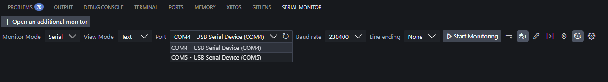
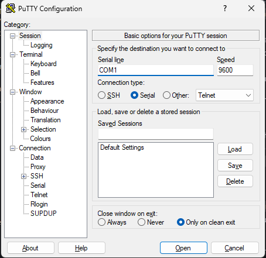

<!-- markdownlint-disable MD033 -->

# Testing and Debugging the Pico W Firmware

## Testing

The firmware includes a set of test scripts to verify the functionality of different modules. These scripts can be run directly on the Pico W.

### [`test_api_net.py`](/firmware/picow/python/test_api_net.py)

This script tests the network communication with the server.

- It verifies the Wi-Fi connection.
- It sends test GET and POST requests to the server's endpoints to ensure that the API communication is working correctly.
- It uses the [`api_net.py`](/firmware/picow/python/api_net.py) module for testing against the legacy .NET server endpoints. A separate test for the Next.js API is planned.

### [`test_commands.py`](/firmware/picow/python/test_commands.py)

This script is used to test the command processing logic.

- **`reading_commands()`**: This function continuously reads the physical blocks and prints the processed commands to the console. It's useful for debugging the hardware setup.
- **`simulate_commands()`**: This function runs a series of predefined test cases to verify the command conversion logic without needing the physical blocks. It's ideal for testing the `convert_to_command` and `add_command_to_list` functions.

### [`test_led.py`](/firmware/picow/python/test_led.py)

This script provides a visual confirmation that all LEDs are working as expected.

- It includes a variety of test functions to check individual LEDs (onboard, success, error) as well as all LEDs together.
- It runs through different patterns, sequences, and toggle tests to ensure the [`led.py`](/firmware/picow/python/led.py) module is functioning correctly.

## Debugging

> [!NOTE]
> **Controlling Output Verbosity:** The level of detail in the print statements can be controlled by changing the `VERBOSE` boolean constant in the [`config.py`](/firmware/picow/python/config.py) file.

The most effective way to debug the firmware is by using a serial monitor to view `print()` statements from the Pico W. This provides real-time feedback on the device's state and execution flow. The Pico W is designed to run [`main.py`](/firmware/picow/python/main.py) on boot, so serial output will begin as soon as the device is powered and a monitor is connected.

> [!IMPORTANT]
> **Exclusive Port Access:** Only one application can connect to the Pico's serial port at a time. If the Pico is connected via the MicroPico REPL, you cannot open it in another serial monitor (like the VS Code Serial Monitor extension or PuTTY), and vice-versa. Ensure any existing connections are closed before attempting to open a new one.

### Finding the Pico's COM Port

Before you can connect, you need to know which serial port the Pico is on.

- **Windows:** Open **Device Manager** and look under the "Ports (COM & LPT)" section for a device named "USB Serial Device" or similar.
- **macOS/Linux:** Run `ls /dev/tty.*` in a terminal and look for a device like `tty.usbmodem...` or `ttyACM...`.
- **Quick Method:** A simple way to find the port is to watch the list of available ports in your serial monitor tool (like the [VS Code Serial Monitor](vscode:extension/ms-vscode.vscode-serial-monitor) extension) as you connect and disconnect the Pico. The port that appears and disappears is the correct one.

### Method 1: VS Code with MicroPico Extension (REPL)

The recommended [`MicroPico`](vscode:extension/paulober.pico-w-go) extension includes an interactive REPL (Read-Eval-Print Loop), which is excellent for both viewing output and running code snippets. See the [Toolchain Setup](/firmware/picow/python/docs/TOOLCHAIN_SETUP.md) guide for installation instructions.

1. **Connect to the Pico:** Ensure the Pico is connected to your computer via USB.
2. **Open the REPL:** In VS Code, open the Command Palette (<kbd>⌃ Control</kbd> <kbd>⇧ Shift</kbd> <kbd>P</kbd> or <kbd>⌘ Command</kbd> <kbd>⇧ Shift</kbd> <kbd>P</kbd>) and run `MicroPico: Connect`. This opens a terminal panel connected to the Pico.
3. **View Output:** Any `print()` statements from your code will appear here. To see the output from [`main.py`](/firmware/picow/python/main.py), you may need to trigger a reset.
4. **Run Code:**
    - To re-run [`main.py`](/firmware/picow/python/main.py), use the Command Palette and select `MicroPico: Soft-reboot device`.
    - To run the currently open file, use `MicroPico: Run current file`.
    - You can also type Python commands directly into the REPL at the `>>>` prompt to inspect variables or test functions. `machine.reset()`

### Method 2: VS Code with Serial Monitor Extension

For simple, view-only output without the interactive REPL, the official [VS Code Serial Monitor](vscode:extension/ms-vscode.vscode-serial-monitor) extension is a great choice.

1. **Install the Extension:** If you don't have it, install [VS Code Serial Monitor](vscode:extension/ms-vscode.vscode-serial-monitor) from the VS Code Extension Marketplace.
2. **Open Serial Monitor:** Open the Command Palette and run `View: Toggle Serial Monitor`.
3. **Configure and Connect:**
    - A "Serial Monitor" tab will open.
    - In the top, select the correct **Port** for your Pico from the dropdown list.
    - Click **Start Monitoring**.
4. **View Output:** The terminal will immediately show any `print()` output from the Pico as it runs [`main.py`](/firmware/picow/python/main.py) on boot.

  

### Method 3: External Serial Monitor (PuTTY)

You can use any standard serial terminal application, such as PuTTY (on Windows) or `screen` (on macOS/Linux).

1. **Configure PuTTY:**
    - **Connection type:** Select **Serial**.
    - **Serial line:** Enter the COM port you identified (e.g., `COM3`).
    - No other changes need to be made.
2. **Connect:** Click **Open**. A terminal window will appear and display the output from the Pico.

  

